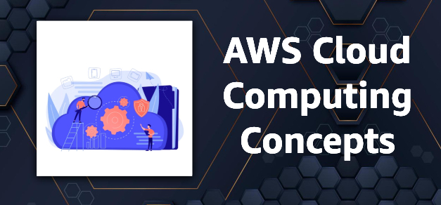

# AWS Cloud Computing Study Guide #1

## Cloud Concepts

### Basics

#### Q: What's Cloud Computing in simple terms?
A: Think of it as renting computer power over the internet instead of buying and maintaining your own hardware. It's like using someone else's super-powerful computer remotely.

#### Q: What are the main cloud deployment models?
A: There are three main types:
- Public cloud: Shared resources you can rent. Think of it as an apartment building.
- Private cloud: Your own dedicated setup. Like having your own house.
- Hybrid cloud: A mix of both. You've got an apartment but also keep some stuff at home.

#### Q: Why do people love cloud computing?
A: It's got some sweet perks:
- Scalability: Grow or shrink your resources as needed.
- Cost-effective: Only pay for what you use.
- Flexibility: Work from anywhere with internet access.
- Reliability: Built-in backups and redundancy.

### Amazon EC2

#### Q: What flavors does Amazon EC2 come in?
A: EC2 has different instance types for various needs:
- General purpose: Jack-of-all-trades, good for most workloads.
- Compute optimized: For heavy number-crunching tasks.
- Memory optimized: When you need to handle lots of data quickly.
- Storage optimized: For tasks that read/write data intensively.

#### Q: What's a Load Balancer and why should I care?
A: Think of it as a smart traffic cop for your website. It directs incoming requests to different servers to prevent any one server from getting overwhelmed.

### AWS Global Infrastructure

#### Q: What's the deal with AWS Regions?
A: Regions are geographic areas with multiple data centers. They help improve performance and reliability by letting you put your stuff closer to your users.

#### Q: How does CloudFront fit into all this?
A: CloudFront is AWS's content delivery network. It's like having a bunch of mini-servers all over the world to serve your content faster.

#### Q: What are Edge locations and why are they cool?
A: Edge locations are like CloudFront's sidekicks. They cache your content closer to users for even faster access.

#### Q: How does Route 53 work with Edge locations?
A: Route 53 uses Edge locations to route users to the nearest content source, kind of like a global GPS for your website.

#### Q: What's AWS Outposts?
A: It's like having a slice of AWS in your own data center. Useful if you need to keep some stuff on-premises.

#### Q: How's Lambda different from Outposts?
A: Lambda is serverless computing - you just run code without managing servers. Outposts is actual hardware you can touch.

### Availability and Reliability

#### Q: What's high availability all about?
A: It's about keeping your services up and running, even if something goes wrong. Like having a backup generator for your house.

#### Q: Why is AWS's global infrastructure a big deal?
A: It gives you better performance, reliability, and disaster recovery options. It's like having backup plans for your backup plans.

#### Q: What exactly is an AWS Region?
A: It's a physical location with multiple data centers. Think of it as AWS's version of a city.

#### Q: Why should I care about data sovereignty?
A: It's about keeping data within specific geographic boundaries. Important if you're dealing with strict regulations.

#### Q: How do Regions help with disaster recovery?
A: Multiple regions give you backup locations. If one region goes down, you can fail over to another.

#### Q: What should I think about when choosing a Region?
A: Consider things like latency (how fast), cost, available services, and compliance requirements.

#### Q: What's an Availability Zone?
A: It's an isolated data center within a Region. Think of it as a neighborhood in AWS's city.

#### Q: Why have multiple Availability Zones?
A: For redundancy and fault tolerance. If one zone has issues, the others can pick up the slack.

#### Q: How does AWS keep communication between AZs fast?
A: They're connected by high-speed, low-latency networks. Like super-fast highways between neighborhoods.

#### Q: Why run EC2 instances across multiple AZs?
A: For high availability and fault tolerance. If one AZ goes down, your app keeps running in the others.

### AWS Services and Interactions

#### Q: What's an API in AWS-speak?
A: It's how you talk to AWS services programmatically. Like giving commands to AWS in a language it understands.

#### Q: How do most people interact with AWS?
A: Through APIs, usually via SDKs (software development kits) or the CLI (command line interface).

#### Q: What are the main ways to interact with AWS?
A: You've got options: the web Console, CLI, SDKs, and direct API calls.

#### Q: Why is automation a big deal in the cloud?
A: It reduces errors and speeds up deployments. Less human error, more consistency.

#### Q: What's cool about Elastic Beanstalk?
A: It simplifies deployment and management of web apps. Less time fiddling with settings, more time coding.

#### Q: How does CloudFormation help manage AWS resources?
A: It lets you create and manage AWS resources using templates. Like a blueprint for your entire AWS setup.

#### Q: What's the best practice for deploying in AWS?
A: Use multiple Availability Zones for high availability. Don't put all your eggs in one basket!

# Amazon EC2 and AWS Computing Services Study Guide

## Amazon EC2 Basics

#### Q: What's Amazon EC2 in a nutshell?
A: EC2 (Elastic Compute Cloud) is like renting virtual servers in the cloud. It's flexible, scalable, and you only pay for what you use.

#### Q: What's so great about EC2?
A: EC2 shines because it's:
- Scalable: Grow or shrink resources as needed
- Cost-effective: Pay only for what you use
- Flexible: Choose your OS, storage, and networking
- Reliable: Runs on Amazon's proven network infrastructure

#### Q: What's a Security Group in EC2?
A: Think of it as a virtual firewall for your EC2 instances. It controls inbound and outbound traffic, like a bouncer for your server.

#### Q: How can I buy EC2 instances?
A: You've got four main options:
- On-Demand: Pay by the second, no commitments
- Reserved: Pay upfront for 1 or 3 years, get a discount
- Spot: Bid on spare EC2 capacity, can be cheaper but less reliable
- Dedicated Hosts: Your own physical servers, good for compliance or licensing needs

#### Q: How does EC2 pricing work?
A: You pay for compute capacity per hour or second. Prices vary based on instance type, region, and purchasing option.

#### Q: What's an AMI?
A: An Amazon Machine Image is like a template for your instance. It includes the OS and any additional software you need.

#### Q: How does EC2 play with other AWS services?
A: EC2 integrates well with many AWS services. For example, it can use S3 for storage, CloudWatch for monitoring, and ELB for load balancing.

## AWS Computing Models

#### Q: What computing models does AWS offer?
A: AWS provides three main models:
- Instances: Virtual servers (like EC2)
- Containers: Lightweight, portable computing environments
- Serverless: Run code without managing servers

#### Q: What are containers good for?
A: Containers are great for:
- Consistent development environments
- Easy application packaging and deployment
- Efficient resource use

#### Q: When would I use serverless computing?
A: Serverless is perfect for:
- Event-driven applications
- Microservices
- Scenarios where you don't want to manage infrastructure

#### Q: When might I consider a hybrid deployment?
A: Consider hybrid when you:
- Have specific workloads that must stay on-premises
- Need to meet certain regulatory requirements
- Want to gradually move to the cloud

## Popular AWS Computing Services

#### Q: What's AWS Lambda?
A: Lambda is AWS's serverless computing service. You upload your code, and Lambda runs it without you needing to manage servers.

#### Q: What about Amazon ECS?
A: ECS (Elastic Container Service) is for running and managing Docker containers. It's like a playground for your containerized apps.

#### Q: How's AWS Fargate different from EC2?
A: Fargate is serverless containers. Unlike EC2 where you manage the underlying instances, with Fargate you just run your containers and AWS handles the rest.

#### Q: Why use Elastic Beanstalk?
A: Elastic Beanstalk makes it easy to deploy and scale web applications. It's like having AWS set everything up for you automatically.

## EC2 Deep Dive

#### Q: How does EC2 show off its elasticity?
A: EC2 can automatically scale up or down based on demand. You can add or remove capacity within minutes.

#### Q: How much control do I have over EC2 instances?
A: You have full control. You can access them like any other server, install software, configure settings, etc.

#### Q: What security features does EC2 offer?
A: EC2 provides:
- Security groups for firewall rules
- Network ACLs for subnet-level security
- Encryption for data at rest and in transit
- IAM for access control

#### Q: What are EC2's main components?
A: The key parts are:
- Amazon Machine Images (AMIs)
- Instance types
- Network interfaces
- Storage options (EBS, instance store)

#### Q: What should I think about when choosing an EC2 region?
A: Consider:
- Latency to your users
- Cost (prices vary by region)
- Compliance requirements
- Available services (not all services are in all regions)

#### Q: What's a VPC and why do I need it for EC2?
A: A Virtual Private Cloud is your own private section of the AWS cloud. It's where your EC2 instances live, giving you network isolation and control.

#### Q: What are subnets in EC2?
A: Subnets are sections of a VPC. They help you organize and secure your resources, like putting different departments on different floors of a building.

#### Q: How do I launch an EC2 instance?
A: The basic steps are:
1. Choose an AMI
2. Select an instance type
3. Configure instance details (VPC, subnet, etc.)
4. Add storage
5. Add tags
6. Configure security group
7. Review and launch

#### Q: Why is tagging important in EC2?
A: Tags help you organize, track, and manage your EC2 resources. They're like labels that make it easier to identify and group your instances.

#### Q: Can EC2 scale automatically?
A: Yes! You can use Auto Scaling to automatically adjust the number of EC2 instances based on conditions you define.

#### Q: What's great about using AMIs?
A: AMIs are awesome because they:
- Speed up deployment (your software is pre-installed)
- Provide consistency across instances
- Can be shared or sold to other AWS users
