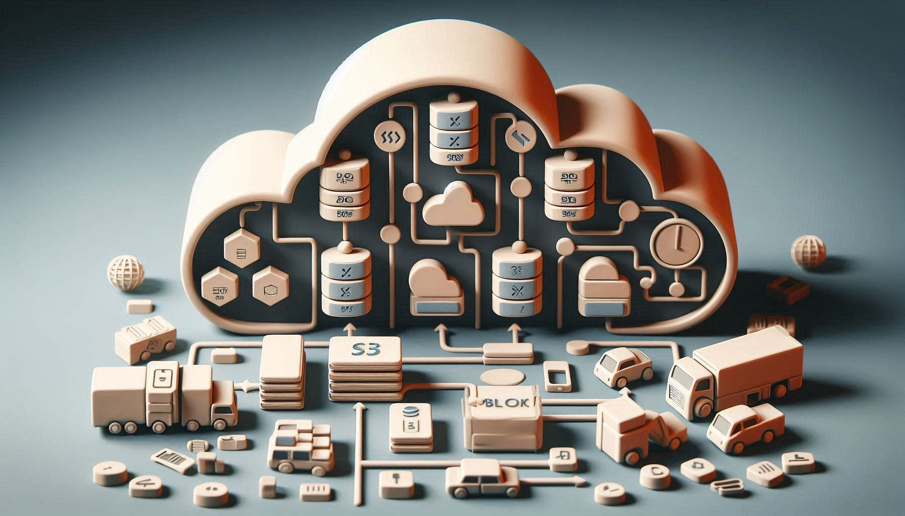

# Storage

  

## Summary 
In this section, you'll explore various AWS storage services and concepts, including Amazon S3 for object storage, Amazon EBS for block storage, and Amazon EFS for file storage. The section dives into different storage classes, durability, and availability features, as well as use cases for each type of storage. You'll also learn about backup and recovery options like EBS Snapshots and the differences between storage services. This section is crucial for managing data effectively in the cloud.

### **What is object storage typically used for in cloud computing?**
Object storage is typically used for storing large amounts of unstructured data such as media files, backups, and logs. It is ideal for use cases that involve write-once, read-many access patterns, and large-scale storage needs.

### **How does Amazon S3 handle durability and availability for object storage?**
Amazon S3 handles durability by automatically storing data across multiple devices in multiple facilities within an AWS region. It offers 99.999999999% durability and 99.99% availability, ensuring that data is highly resilient to failures.

### **What are some typical use cases for Amazon S3?**
Typical use cases for Amazon S3 include data backup and restore, disaster recovery, archiving, content distribution, and hosting static websites.

### **What is the main difference between Amazon S3 Standard and Amazon S3 Standard-IA storage classes?**
The main difference is in their cost and availability. S3 Standard is designed for frequently accessed data, offering high availability and performance. S3 Standard-IA (Infrequent Access) is more cost-effective for data that is accessed less frequently, with slightly lower availability and retrieval fees.

### **What is the Amazon S3 Glacier storage class used for?**
Amazon S3 Glacier is used for long-term data archiving where retrieval times of several minutes to hours are acceptable. It is a low-cost storage option for data that is infrequently accessed but must be retained for extended periods.

### **How does Amazon S3 Intelligent-Tiering work, and what are its benefits?**
S3 Intelligent-Tiering automatically moves objects between two access tiers (frequent and infrequent access) based on changing access patterns. The benefits include cost optimization without performance impact, as data is automatically placed in the most cost-effective storage tier.

### **Explain the use case for Amazon S3 One Zone-IA.**
Amazon S3 One Zone-IA is designed for infrequently accessed data that doesn’t require the multiple Availability Zone data resilience of other S3 storage classes. It’s suitable for use cases such as storing secondary backups or easily reproducible data.

### **What is Amazon Elastic Block Store (Amazon EBS) and what are its primary use cases?**
Amazon EBS provides block-level storage volumes for use with EC2 instances. Primary use cases include boot volumes, transactional workloads, databases, and applications that require consistent and low-latency storage performance.

### **What are the main types of EBS volumes and their characteristics?**
- General Purpose SSD (gp3, gp2): Balanced price and performance for a wide variety of workloads.
- Provisioned IOPS SSD (io2, io1): Designed for I/O-intensive applications like databases.
- Throughput Optimized HDD (st1): Low-cost storage for frequently accessed, throughput-intensive workloads.
- Cold HDD (sc1): Lowest cost storage for infrequently accessed workloads.

### **What is the difference between Amazon EBS and instance store?**
Amazon EBS provides persistent block storage that is independent of the lifecycle of an EC2 instance, whereas instance store offers temporary storage that is physically attached to the host machine and is lost when the instance is stopped or terminated.

### **What are some common use cases for instance store volumes?**
Common use cases include temporary storage for data that is replicated across multiple instances, such as caches, buffers, or scratch data, where data loss upon instance termination is acceptable.

### **Can you attach an EBS volume to multiple EC2 instances at the same time?**
No, an EBS volume can generally only be attached to one EC2 instance at a time. However, Amazon EBS Multi-Attach allows you to attach a single Provisioned IOPS SSD (io1/io2) volume to multiple instances within the same Availability Zone.

### **What is the maximum size of a single Amazon EBS volume?**
The maximum size of a single Amazon EBS volume is 16 TiB.

### **How do you ensure the durability of data stored in Amazon EBS?**
Data durability in Amazon EBS is ensured by replicating the data within the same Availability Zone, protecting it from component failure. Regular snapshots to Amazon S3 further enhance durability and provide backup recovery.

### **What is Amazon EBS Snapshots and how are they used?**
Amazon EBS Snapshots are point-in-time backups of EBS volumes that are stored in Amazon S3. Snapshots can be used to create new volumes, restore existing volumes to an earlier state, or replicate volumes across different regions.

### **Can you change the volume type of an existing Amazon EBS volume?**
Yes, you can change the volume type of an existing Amazon EBS volume using Elastic Volumes, which allows you to modify the volume type, size, and performance characteristics without downtime.

### **What is Amazon Elastic File System (Amazon EFS) and what are its primary use cases?**
Amazon EFS provides a scalable, fully-managed file storage service that can be accessed by multiple EC2 instances simultaneously. Primary use cases include shared file storage for applications, content management, and big data analytics.

### **What are the key features of Amazon EFS?**
Key features of Amazon EFS include automatic scaling, high availability, and durability, integration with on-premises environments, and support for NFSv4 and NFSv4.1 protocols.

### **What is Amazon FSx and what file systems does it support?**
Amazon FSx provides fully managed native file systems that are optimized for a variety of workloads. It supports file systems such as Amazon FSx for Windows File Server, Amazon FSx for Lustre, and Amazon FSx for NetApp ONTAP.

### **What are common use cases for Amazon FSx for Windows File Server?**
Common use cases include enterprise applications that require shared file storage with Windows-based workloads, such as Microsoft SQL Server, SharePoint, and custom .NET applications.

### **Can Amazon EFS be accessed from on-premises environments?**
Yes, Amazon EFS can be accessed from on-premises environments through AWS Direct Connect or AWS VPN, allowing for a hybrid cloud file storage solution.

### **What is the difference between Amazon EFS and Amazon FSx for Windows File Server?**
Amazon EFS is designed for Linux-based workloads and supports NFS, whereas Amazon FSx for Windows File Server is optimized for Windows-based applications and supports the SMB protocol.

### **What are the performance modes available in Amazon EFS?**
Amazon EFS offers two performance modes: General Purpose (for low-latency and high-throughput workloads) and Max I/O (for applications requiring higher levels of aggregate throughput).
